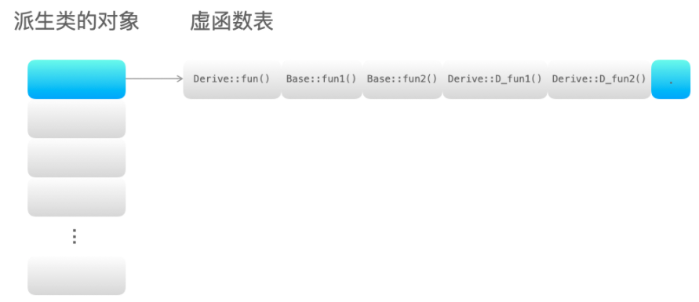

# C++基础

- 引用和指针的区别

指针是一个变量，存储地址，指向内存存储单元。

引用是原变量的别名，和原变量是一个东西。

- 函数中父类为形参，子类为实参，并且形参是引用

在函数中调用父类的虚函数，在主函数中传入子类，最后调用的是子类的函数

```c++
#include<iostream>
using namespace std;

class Fish {
    public:
    virtual void show() {
        cout << "fish" << endl;
    }
};

class Carp: public Fish {
    public:
    void show() {
        cout << "carp" << endl;
    }
};

void print(Fish& fish) {
    fish.show();
}

int main() {
    Carp carp;
    print(carp);
    return 0;
}
```

- 拷贝构造函数

## 类相关

### 什么是多态

多态是不同继承类的对象，对同一消息做出不同的响应。基类的指针指向或者绑定到派生类的对象，使得基类指针呈现出不同的表现方式。具体来说，在基类的函数前加`virtual`关键字，在派生类中重写该函数，运行时根据对象类型调用对应函数。

实现方法：多态通过虚函数实现，一个类有虚函数表，里面保存了虚函数地址。虚函数表的地址保存在含有虚函数的类的实例对象的内存空间中。

实现过程：

1. 在类中用`virtual`关键词声明虚函数；
2. 存在虚函数的类有一个虚函数表，当创建对象时，该对象有一个虚表指针；
3. 当基类指针指向派生类对象，调用虚函数时，实际指向派生类的虚表指针，找到相应的虚函数。

例子：

```c++
#include <iostream>
using namespace std;

class Base
{
public:
	virtual void fun() { cout << "Base::fun()" << endl; }

	virtual void fun1() { cout << "Base::fun1()" << endl; }

	virtual void fun2() { cout << "Base::fun2()" << endl; }
};
class Derive : public Base
{
public:
	void fun() { cout << "Derive::fun()" << endl; }

	virtual void D_fun1() { cout << "Derive::D_fun1()" << endl; }

	virtual void D_fun2() { cout << "Derive::D_fun2()" << endl; }
};
int main()
{
	Base *p = new Derive();
	p->fun(); // Derive::fun() 调用派生类中的虚函数
	return 0;
}
```

从下图可以看出，如果派生类重写虚函数`fun()`，派生类虚函数表中没有`Base::fun()`，只有`Derive::fun()`。



### 什么是虚函数和纯虚函数

虚函数：被`virtual`关键字修饰的成员函数

```c++
class A {
    public:
    virtual void test() {cout<<"is A"<<endl;} //虚函数
};

class B:public A {
    public:
    virtual void test() {cout<<"is B"<<endl;} //重写
};

int main() {
    A *p=new B();
    p->test(); // is B
    return 0;
}
```

纯虚函数：

- 纯虚函数在类中声明时，加上`=0`;
- 含有纯虚函数的类是抽象类，类中有接口，没有具体实现方法；
- 继承纯虚函数的派生类，如果没有完全实现基类纯虚函数，不能实例化对象。子类必须继承父类的纯虚函数并全部实现后才能创建子类对象。

两者区别：

- 虚函数和纯虚函数可以出现在同一个类中，该类称为抽象基类。

- 使用方式不同：虚函数可以直接使用，纯虚函数必须在派生类实现后才能使用；
- 定义形式不同：虚函数需要加`virtual`关键字，纯虚函数还要加`=0`；
- 析构函数最好定义为虚函数，特别是对于含有继承关系的类；析构函数可以定义为纯虚函数，此时，其所在的类为抽象基类，不能创建实例化对象。

### 虚函数实现机制

虚函数通过虚函数表实现。虚函数地址保存在虚函数表中，虚函数表和类绑定，类的不同对象的的虚函数表是一样的。在类的对象所在的内存空间中保存了虚表指针。虚表指针和对象绑定，每个类的对象都有自己的虚表指针，指向类的虚函数表。

- 虚函数表存放的内容：类的虚函数地址
- 虚函数表建立时间：编译阶段
- 虚表指针保存的位置：对象内存空间最前面，为了正确取到虚函数的偏移值
- **虚函数表和类对应的，虚表指针是和对象对应**

### 单继承和多继承的虚函数表结构

- 如果派生类没有重新定义基类虚函数A，那么派生类虚函数表中保存的是基类虚函数A的地址；
- 如果派生类重写了基类的某个虚函数 B，则派生的虚函数表中保存的是重写后的虚函数 B 的地址；
- 如果派生类重新定义了新的虚函数 C，派生类的虚函数表保存新的虚函数 C 的地址；

- 多继承有虚函数覆盖的话，派生类的虚函数表分为多个，每个表对应的虚函数A都是派生类改写的虚函数地址。

```c++
#include <iostream>
using namespace std;

class Base1
{
public:
    virtual void fun1() { cout << "Base1::fun1()" << endl; }
    virtual void B1_fun2() { cout << "Base1::B1_fun2()" << endl; }
    virtual void B1_fun3() { cout << "Base1::B1_fun3()" << endl; }
};
class Base2
{
public:
    virtual void fun1() { cout << "Base2::fun1()" << endl; }
    virtual void B2_fun2() { cout << "Base2::B2_fun2()" << endl; }
    virtual void B2_fun3() { cout << "Base2::B2_fun3()" << endl; }
};
class Base3
{
public:
    virtual void fun1() { cout << "Base3::fun1()" << endl; }
    virtual void B3_fun2() { cout << "Base3::B3_fun2()" << endl; }
    virtual void B3_fun3() { cout << "Base3::B3_fun3()" << endl; }
};

class Derive : public Base1, public Base2, public Base3
{
public:
    virtual void fun1() { cout << "Derive::fun1()" << endl; }
    virtual void D_fun2() { cout << "Derive::D_fun2()" << endl; }
    virtual void D_fun3() { cout << "Derive::D_fun3()" << endl; }
};

int main(){
    Base1 *p1 = new Derive();
    Base2 *p2 = new Derive();
    Base3 *p3 = new Derive();
    p1->fun1(); // Derive::fun1()
    p2->fun1(); // Derive::fun1()
    p3->fun1(); // Derive::fun1()
    return 0;
}

//作者：力扣 (LeetCode)
//链接：https://leetcode-cn.com/leetbook/read/cpp-interview-highlights/efd81s/
//来源：力扣（LeetCode）
//著作权归作者所有。商业转载请联系作者获得授权，非商业转载请注明出处。
```

### 构造函数和析构函数是否需要定义为虚函数

构造函数一般不定义为虚函数，因为如果这样定义，那么在调用构造函数实例化对象时，需要访问该对象的内存空间，通过虚表指针调用虚构造函数；但是此时对象还未创建，无法调用虚表指针。因此不能定义构造函数为虚函数。

析构函数一般定义为虚函数，为了防止内存泄漏。当基类的指针或者引用绑定到派生类的对象时，如果未将基类析构函数定义为虚函数，那么只会调用基类的析构函数，无法释放派生类的内存空间，导致内存泄漏。

### 拷贝构造函数

**拷贝构造函数**是一种特殊的构造函数，它在创建对象时，是使用同一类中之前创建的对象来初始化新创建的对象。

```c++
classname (const classname &obj) {
    //...
}
```

例子

```c++
#include <iostream>
using namespace std;
class Line {
    public:
    int* ptr;
    Line() {
        ptr = new int(10);
    }
    ~Line() {
        delete ptr;
    }
    Line(const Line& obj) {
        ptr = new int(*obj.ptr);
    }
};

int main() {
    Line A;
	Line B(A);
    return 0; 
}
```

如果没有拷贝构造函数，B复制了A的栈区，但是B.ptr指向的是A的内存区。当程序结束时，首先执行B的析构函数释放指针，然后A也释放同一个内存，出现两次释放错误。因此需要拷贝构造函数，对复制对象的指针分配新的堆空间。

### 深拷贝和浅拷贝

- 深拷贝：该对象和原对象占用不同的内存空间，既拷贝存储在栈空间中的内容，又拷贝存储在堆空间中的内容。
- 浅拷贝：该对象和原对象占用同一块内存空间，仅拷贝类中位于栈空间中的内容。

当类的成员变量中有指针变量时，最好使用深拷贝。因为当两个对象指向同一块内存空间，如果使用浅拷贝，当其中一个对象的删除后，该块内存空间就会被释放，另外一个对象指向的就是垃圾内存。

直接进行对象的复制或者函数调用的形参为对象时会造成浅拷贝。

深拷贝方法：

- 定义拷贝构造函数
- 函数中使用变量的引用

### 指针和引用的区别

- 指针所指向的内存空间在程序运行过程中可以改变，而引用所绑定的对象一旦绑定就不能改变。
- 指针本身在内存中占有内存空间，引用相当于变量的别名，在内存中不占内存空间。
- 指针可以为空，但是引用必须绑定对象。
- 指针可以有多级，但是引用只能一级。

### 常量指针和指针常量的区别

**常量指针：**

常量指针本质上是个指针，只不过这个指针指向的对象是常量。

特点：`const` 的位置在指针声明运算符 `*` 的左侧。常量指针指向的对象不能通过这个指针来修改，因为指向的是常量。常量指针本身是一个变量，因此，可以被重新赋值。

```c++
int main()
{
    const int c_var1 = 8;
    const int c_var2 = 8;
    const int *p = &c_var1; 
    p = &c_var2;
    return 0;
}
```

**指针常量：**

指针常量的本质上是个常量，只不过这个常量的值是一个指针。

特点：`const` 位于指针声明操作符右侧，表明该对象本身是一个常量。指针常量的值是指针，这个值因为是常量，所以指针本身不能改变。指针的内容可以改变。

```c++
#include <iostream>
using namespace std;

int main()
{
    int var, var1;
    int * const c_p = &var;
    *c_p = 12;   // no problem
    c_p = &var1; // error: assignment of read-only variable 'c_p'

    return 0;
}
```

**指向常量的指针常量（const int \* const p）**: p的指向不可修改，p所指的内存区域中的值也不可修改（是常量）。

